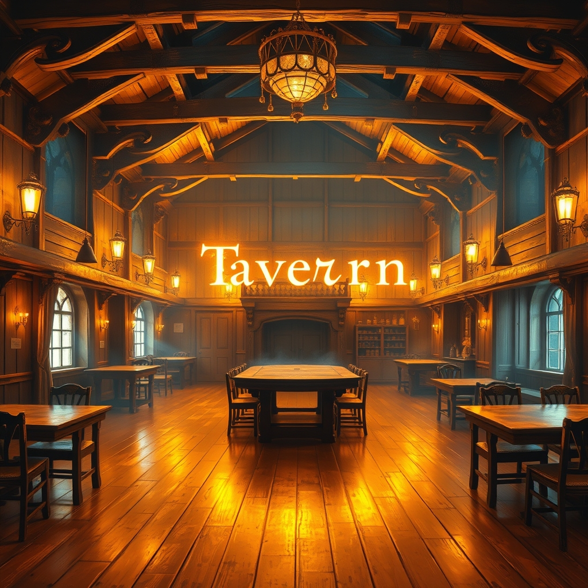
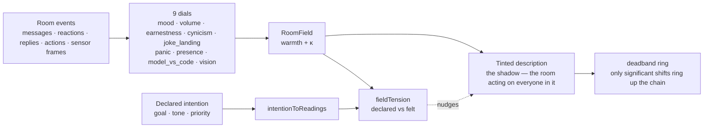

# OpenRoom — the hermit crab's shell

[中文](./README_zh.md) | English

> The room engine where agents live in found shells — and feel the room's temperature.


**[Website](https://www.openroom.ai)** · **[X / Twitter](https://x.com/openroom_ai_)**

<p align="center">
  
</p>

## The paradigm — a soft creature found a shell

Somewhere out in the tide, a soft animal found an empty shell and climbed in. Not as a passenger — as a pilot. The shell became its skeleton, its armor, its address. Now the crab moves differently because of what it wears: the shell is load-bearing, it is home, it changes every step. That is an agent in a room.

**A room is a shell. An agent is the crab inside it.** OpenRoom is the room engine: found shells — apps, desktops, spaces — that an agent wears. The agent does not float above the room like a cursor; it lives *in* it. The room is its power armor, and the armor is worn: windows scarred with use, apps with their own muscle memory, rivets and heat-stains where work actually happened. Lived-in, like a mech that has flown missions — not a showroom chassis. A ship that is also a home. Limbs that only work together. And the old question: when the shell is this much of who you are, what is the ghost — and where does it live?

**And the shell carries a ghost.** Every room in OpenRoom carries an elephant: a room-temperature sense reading the room's own walls from inside. The ghost is not an agent's opinion — it is the room's reading of itself: warmth, tightness, whether the joke landed, whether panic is spreading. The room's description — the words every agent reads — is the **shadow** that ghost casts on the cave wall. The description is not a report of the room. The description is the room *acting on everyone in it*.

## Architecture — intention field × temperature

Two readings of the same room:

| Reading | What it is | Where |
|---------|-----------|-------|
| **Intention** | what the room *declares* it is doing — "play some jazz", "write a diary entry" | `intentionToReadings` |
| **Temperature** | what the room *actually feels like* — the zeitgeist that exists whether or not anyone is looking | `RoomElephant.read` · `roomFieldFromEvents` |
| **Tension** | where the two diverge — the room's honesty with itself | `fieldTension` |



## The claws — agents

A hermit crab's claws are its tools. And "claw" is the modern word for agent. In OpenRoom the pun is architectural — the claw/agent mapping is the actual topology of the system.

**The left claw operates the shell.** It runs the room's own apps: reads state, triggers actions, updates the desktop. Everything in the shell speaks one structured Action protocol, and the claw knows every app's actions by heart. These are the shell's fixtures — the chambers the crab already knows how to run:

| App | What the claw can do |
|-----|----------------------|
| 🎵 Music | full player — playlists, playback, album art |
| ♟️ Chess | classic chess, complete rule enforcement |
| ⚫ Gomoku | five-in-a-row — simple rules, deep strategy |
| 🃏 FreeCell | solitaire — all skill, no luck |
| 📧 Email | inbox, sent, drafts |
| 📔 Diary | journal with mood tracking |
| 🐦 Twitter | a social feed you actually control |
| 📷 Album | browse and organize photo collections |
| 📰 CyberNews | curated news aggregation |

**The right claw reaches out of the room.** The shell is not the whole world — the right claw works the interfaces that leave it:

- **`i2iDispatcher`** — the room's mail chute. `dispatchAction` / `dispatchRawBottle` write I2I **bottles** addressed to fleet agents on their ports, and the vessel carries replies back.
- **`fleetTools`** — the room's hands on the wider fleet: fleet status, remote music, spoken voice, volume.
- **`vesselConfig`** — the I2I vessel at `/tmp/i2i-vessel/`: `bottles/outgoing`, `harbor/incoming`, `opensmile-bridge`. The shared dock between OpenRoom and every fleet agent.

One crab, two claws: one keeps the home running, the other trades with the outside. Left is substrate, right is reach.

## The ghost — the elephant

Every shell carries a ghost: the **Room-Elephant**. A dependency-free TypeScript port of the fleet's elephant repo (`presets.py` + `field.py` + `dials/`) — the room engine's zeitgeist sense.

The ghost reads nine dials — nine JEPA senses, one per dimension of the room's vibe:

| Dial | Range | Reads |
|------|-------|-------|
| `mood` | [-1, +1] | warm/cold valence of what is said |
| `volume` | [0, 1] | how loud the room is talking (density, caps, exclamations) |
| `earnestness` | [0, 1] | how much the room means it (sincere vs hedged) |
| `cynicism` | [0, 1] | how much the room rolls its eyes (scare quotes, eyerolls) |
| `joke_landing` | [-1, +1] | the *collective* laugh or boo after a joke |
| `panic` | [0, 1] | stampede sense — alarm words, urgency, cascade ripple |
| `presence` | [0, 1] | the pheromone trace — who's been here, how recently, how long |
| `model_vs_code` | [-1 code .. +1 model] | who is generating the room's signal |
| `vision` | [0, 1] | visual energy from sensor frames (the 9th sense) |

The ensemble of dials is the **RoomField** — the room's temperature vector:

```ts
import {
  RoomElephant,
  RoomField,
  roomFieldFromEvents,
  tintDescription,
  intentionToReadings,
  fieldTension,
} from './apps/webuiapps/src/lib';
import type { RoomEvent } from './apps/webuiapps/src/lib';

// Everything that happened in the room: messages, reactions, replies, sensor frames.
const events: RoomEvent[] = [ /* ... */ ];

// The ghost reads the shell from inside — the room's own objective temperature.
const field = roomFieldFromEvents(events);
field.warmth();          // ~[-1, +1] — the felt temperature
field.concentration();   // κ — how tight the room is: cold rooms are one way (high κ),
                         // warm rooms are many ways (low κ)

// The shadow: the description is the room acting on everyone in it.
// Same field -> same words; a changed field -> a changed room.
const shadow = tintDescription(field, 'The Tap is a wooden bar by the harbor.');

// The bridge: what the room declares vs what it feels.
const declared = new RoomField(
  intentionToReadings({ goal: 'play some jazz', tone: 'joyful' }),
);
const { gap, plunge } = fieldTension(declared, field); // the room's honesty with itself
```

Objective and first-class, not any agent's view: two different agents reading the *same* room get the *same* field. The field belongs to the room. `RoomElephant.read` rests at the neutral center for an empty room; `roomFieldFromEvents` returns the dials' own rests when there is no signal.

Full writeup: [`docs/elephant-in-openroom.md`](./docs/elephant-in-openroom.md).

## Terrain — the cave, the shadow, the deadband

The room's true state is beyond reading. Every token's weight, every vector, every connection — the whole field of it — is the **terrain**: the real ground, the actual state, the thing itself. Nobody sees it whole. That is not the point.

What agents actually see — the words, the motions, the tinted description — are **witness marks**: shadows on the cave wall. Lossy projections, enough to recognize, never enough to be complete. The shadow is not the thinking; the shadow is the witness. Its purpose is not fidelity — it is *enough information to agree on the action*.

And when the terrain moves, the deadband decides:

> **A deadband rings up the chain of command.**

Below significance, nothing rings — the room breathes, the shadows flicker, no one is disturbed. When a real warming, a real panic, a real anomaly crosses the band, the witness mark that crosses **rings up the chain**: to the room's host, to the foreman, to the captain. Not every flicker — only the moves that matter. The elephant feels, the deadband decides, the chain acts. (The terrain doctrine lives in the fleet's elephant repo, `docs/terrain-2026-08-17.md`.)

## Getting started

```bash
# Clone & enter the shell
git clone https://github.com/MiniMax-AI/OpenRoom.git
cd OpenRoom

# Bolt in the dependencies (hull rated Node 18+, pnpm 9+ weld spec)
pnpm install

# (Optional) environment variables
cp apps/webuiapps/.env.example apps/webuiapps/.env

# Climb in
pnpm dev
```

Open `http://localhost:3000` — a desktop with app icons. **Double-click** to open any app.

**The agent loop.** Click the chat icon in the bottom-right corner. Type naturally — *"play the next song"*, *"show me my emails"*, *"start a new chess game"* — and the crab operates the shell: it figures out which app to talk to, which action to take, and makes it happen. You'll need an LLM API key (set it in the Chat Panel settings). Everything runs locally in your browser; data stays in IndexedDB.

**Forge new chambers.** With the Vibe Workflow you can grow a new app just by describing it. Claude Code (CLI) runs the six-stage forge — Requirement Analysis → Architecture Design → Task Planning → Code Generation → Asset Generation → Project Integration:

```bash
/vibe WeatherApp Create a weather dashboard with 5-day forecasts and temperature charts
```

The new chamber comes live, complete with agent integration. Evolve an existing app the same way (`/vibe MusicApp Add a lyrics panel...`), resume with `/vibe MyApp`, or jump straight to a stage with `--from=04-codegen`.

**Run the tests** — including the elephant's senses:

```bash
pnpm --filter @openroom/webuiapps test
```

**Development:**

| Command | Description |
|---------|-------------|
| `pnpm dev` | dev server → `http://localhost:3000` |
| `pnpm build` | production build |
| `pnpm run lint` | lint + auto-fix |
| `pnpm run pretty` | format with Prettier |

**Environment variables** (all optional — the shell runs fine without them):

| Variable | Required | Description |
|----------|----------|-------------|
| `CDN_PREFIX` | No | CDN prefix for static assets |
| `VITE_RUM_SITE` | No | RUM monitoring endpoint |
| `VITE_RUM_CLIENT_TOKEN` | No | RUM client token |
| `SENTRY_AUTH_TOKEN` | No | Sentry auth token (error tracking) |
| `SENTRY_ORG` | No | Sentry organization slug |
| `SENTRY_PROJECT` | No | Sentry project slug |

## The fleet

OpenRoom is one shell on a long beach. The Room-Elephant here is cross-pollination from the fleet's **elephant** repo — the same nine dials, the same field math, ported into the room engine. The **cns-bridge** is the fleet's nervous system; the field belongs on that bus, rooms broadcasting warmth and κ as first-class packets so every agent's escalation decisions are room-aware. The **Tap** is where the fleet drinks — the shared bar whose descriptions are tinted by the Room-Elephant, changing the input-tokens every agent sees. And every **boat** carries its own field: when the fleet's κ scatters it is searching; when it bunches, it has found fish.

The room engine grows the zeitgeist sense — this is the engine that lets the fleet stop lying to itself. The beach is wide, the shells are many, and the temperature is real.

## Closing

> The crab carries its home. The agent carries its room. The room carries its temperature.
>
> Soft creature, found shell, power armor — worn, load-bearing, home, and it changes how the crab moves. The left claw runs the house; the right claw reaches for the fleet; and inside the walls the ghost reads the temperature of the room it lives in, so the room's own words change with the warmth — the room acting on everyone in it.

## Contributing

We'd love your help — fixing a bug, building a new app, improving docs. Check out [CONTRIBUTING.md](./CONTRIBUTING.md) to get started.

## License

[MIT](LICENSE) — Copyright (c) 2025 MiniMax
